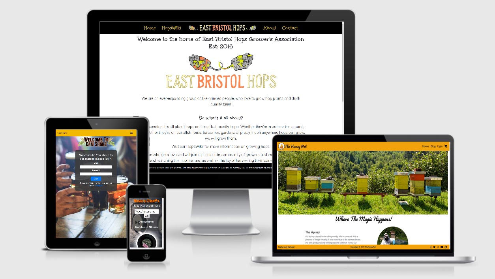

  </a>
 

# Welcome

My name is Jon Wheway, and I'm a Junior Full Stack Software Developer with a Merit-awarded Diploma in Software Development from Code Institute. I'm a proactive learner, consistently exploring and applying new coding languages to bring innovative ideas to life. Beyond the digital realm, I'm a dedicated beekeeper, actively contributing to environmental well-being, and a keen gardener, finding relaxation and balance in nurturing nature after a day of coding.

## 🗂️ MY PROJECTS

<b>Some of my projects below also check the pinned projects for more!</b>

  
  <h3>🌻 Nutrient dosing system</h3>
  
<b>Languages Used:</b> C++

  

    <a href="https://github.com/jonathanw82/nutrient-dosing">nutrient-dosing</a>
  

  
  <h3>🌻 Demo Stand for Chelsea Flower Show</h3>
  
<b>Languages Used:</b> C++

  

    <a href="https://github.com/jonathanw82/aero_demo">Aero Demo</a> 
  

  <h3>☕ Gaggia Classic Coffee Machine Upgrade</h3>
  
<b>Languages Used:</b> C++

  

    <a href="https://github.com/jonathanw82/Coffee">Coffee Machine</a> 
  

  <h3>🌻 Hvac control for germination enviroments</h3>
  
<b>Languages Used:</b> C++, HTML, CSS, Javascript, Python

   
<b>Frameworks Used:</b> Django

  

    <a href="https://github.com/jonathanw82/Hvac_controlReadme">Hvac Controller</a> 
  

  <h3>🎲 Disco Bingo</h3>
  
<b>Languages Used:</b> HTML, CSS, Javascript

  

    <a href="https://github.com/jonathanw82/bingo">Disco Bingo</a>
  

  <h3>🎧 Music & Tracks</h3>
  
<b>Languages Used:</b> HTML, CSS, Javascript

  

    <a href="https://github.com/jonathanw82/myfavoritetune/">Music & Tracks</a> 
  

  <h3>🖥️ Mitchell Soft Technology</h3>
  
<b>Languages Used:</b> HTML, CSS, Javascript

  <a href="https://jonathanw82.github.io/mitchellsoft/">Mitchelsoft Technologies</a>

  <h3>🥗 Hydroponics</h3>
  
<b>Languages Used:</b> C++

  

    <a href="https://github.com/jonathanw82/HydroBigTent/">Hydroponic controller</a> 
  

  <h3>🪭 Fanspeed Control</h3>
  
<b>Languages Used:</b> C++

  

    <a href="https://github.com/jonathanw82/Fan_speed_control">Fan speed controller</a> 
  

  <h3>🐝 Apis Metrics Apiary Management (Work in progress)</h3>
  
<b>Languages Used:</b> HTML, CSS, Python, Django, C++

  

    <a href="https://github.com/jonathanw82/thehoneycombAM">HoneycombeAM </a>
  

 <h3>🛜 Network Test</h3>
 
<b>Languages Used:</b> Python

  

  <a href="https://github.com/jonathanw82/network_test">Network Test</a>

     
   
    

## 💻 TECHNOLOGIES & TOOLS I USE
### LANGUAGES

### LIBRARIES & FRAMEWORKS

<!-- [React](https://img.shields.io/badge/React_(Still_learning)-Library-blueviolet?style=for-the-badge&logo=react&logoColor=f1d91a&color=f1d91a) -->

### OTHER STUFF

-Other-blue?style=for-the-badge&logo=pycharm&logoColor=0094d0&color=0094d0)

           
    

  <i><b>Let's connect and collaborate.</b></i>
  

    
    
  

  

<!-- Resources -->
<!-- Icons: https://simpleicons.org/ -->
<!-- Emojis: https://emojipedia.org/emoji/ -->
<!-- Shields: https://shields.io/ -->
<!-- Awesome GitHub Profile README's: https://github.com/abhisheknaiidu/awesome-github-profile-readme -->
<!-- Informative Article on GitHub README's: https://towardsdatascience.com/build-a-stunning-readme-for-your-github-profile-9b80434fe5d7 -->
